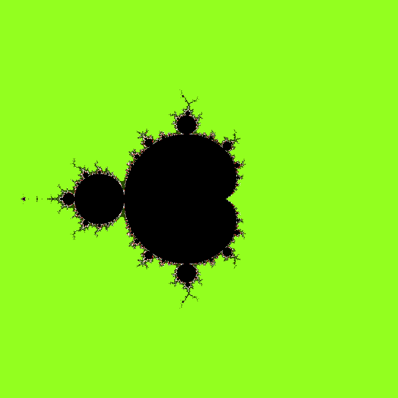
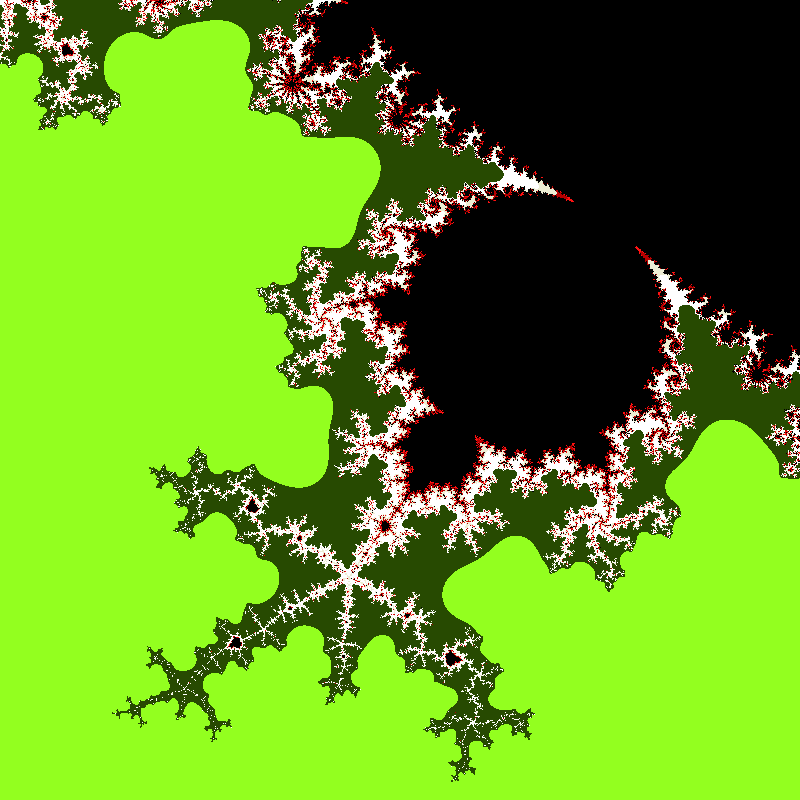

# Fractal OpenGL con Paletas y Zoom

Este proyecto muestra un fractal usando **OpenGL + GLFW**.  
Este fractal tiene 3 paletas de colores:
- Con 6 colores cada una y tematicas diferentes, la cual se elije al inicio de la aplicación.  
- Al fractal también se le puede hacer zoom con clic izquierdo.

---

## Compilación y ejecución

### Antes de
Se necesita tener instalado:
- `glfw`
- `OpenGL`
- `make`
Y los archivos:
- gl.c
- gl.h
Y en el main:
- En vez de GLEW tener GALOGEN

### Para compilar y ejecutar
Desde la terminal en el directorio donde se encuentra el archivo Makefile, compilar con **Make** y después ejecutar con **./cuadrado**

